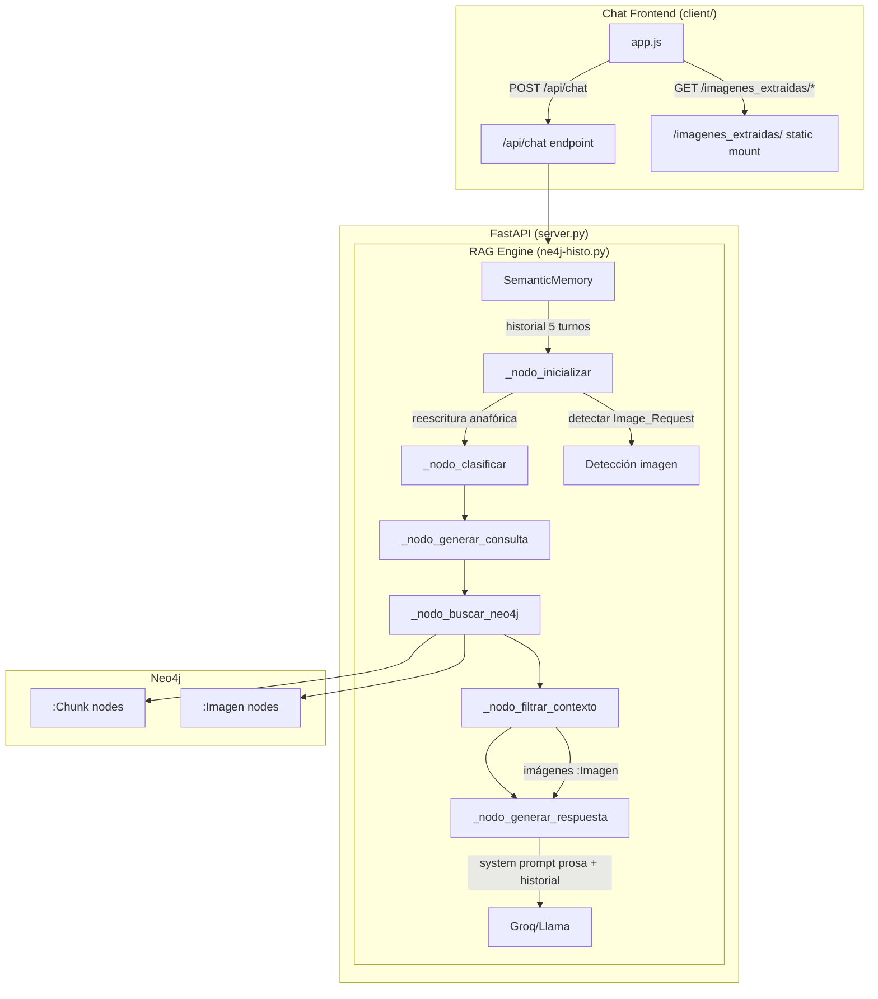
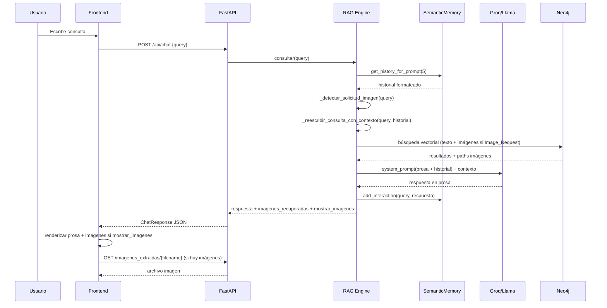

# Design Document: Conversational Chat

## Overview

Esta feature transforma el chat RAG de histología de un sistema de pregunta-respuesta aislado a una experiencia conversacional natural. Se implementan cuatro capacidades interconectadas:

1. **Memoria conversacional real**: Inyectar los últimos 5 intercambios en el system prompt del LLM y resolver referencias anafóricas (e.g., "¿y qué más sobre eso?") reescribiendo la consulta con contexto.
2. **Respuestas en prosa**: Modificar los system prompts para que el LLM responda como un profesor explicando en texto corrido, eliminando listas y bullets.
3. **Devolución de imágenes indexadas**: Servir imágenes desde `imagenes_extraidas/` vía ruta estática y renderizarlas en el frontend cuando corresponda.
4. **Detección de solicitud de imagen**: Clasificar consultas que piden imágenes explícitamente, agregar campo `mostrar_imagenes` a la respuesta, y condicionar el renderizado frontend.

El sistema actual ya tiene `SemanticMemory` con Qdrant y `imagenes_recuperadas` en `ChatResponse`, pero no inyecta historial en el prompt, no resuelve anáforas, responde con formato rígido de listas, y el frontend no renderiza las imágenes recuperadas.

## Architecture



### Cambios arquitectónicos clave

- **SemanticMemory.get_history_for_prompt()**: Nuevo método que retorna los últimos 5 intercambios formateados como `"Usuario: ... / Asistente: ..."`.
- **Reescritura anafórica**: En `_nodo_inicializar`, antes de clasificar, se usa el LLM para reescribir consultas que contengan referencias anafóricas usando el historial.
- **System prompts modificados**: Tanto el prompt de modo texto como el multimodal incluyen instrucción explícita de responder en prosa y reciben el bloque de historial.
- **Detección de Image_Request**: Función `_detectar_solicitud_imagen()` que clasifica la consulta usando keywords y retorna un booleano.
- **Campo `mostrar_imagenes`**: Agregado a `AgentState`, `ChatResponse` y propagado al frontend.
- **Ruta estática**: `server.py` monta `imagenes_extraidas/` como directorio estático.
- **Frontend condicional**: `app.js` renderiza imágenes solo cuando `mostrar_imagenes=true`.

## Components and Interfaces

### 1. SemanticMemory (ne4j-histo.py)

**Cambios:**

```python
def get_history_for_prompt(self, max_turns: int = 5) -> str:
    """Retorna los últimos max_turns intercambios formateados para inyectar en el system prompt."""
    recent = self.conversations[-max_turns:]
    if not recent:
        return ""
    lines = []
    for conv in recent:
        lines.append(f"Usuario: {conv['query']}")
        # Truncar respuesta a ~200 chars para no saturar el prompt
        resp_truncada = conv['response'][:200] + "..." if len(conv['response']) > 200 else conv['response']
        lines.append(f"Asistente: {resp_truncada}")
    return "\n".join(lines)
```

### 2. Reescritura anafórica (_nodo_inicializar)

**Lógica:** Si el historial no está vacío y la consulta contiene pronombres anafóricos ("eso", "esa", "esto", "lo mismo", "sobre eso", "al respecto", "más sobre"), se invoca al LLM con un prompt corto para reescribir la consulta incorporando el contexto.

```python
async def _reescribir_consulta_con_contexto(self, consulta: str, historial: str) -> str:
    """Reescribe la consulta resolviendo referencias anafóricas usando el historial."""
    ANAFORAS = ["eso", "esa", "esto", "lo mismo", "sobre eso", "al respecto", 
                "más sobre", "qué más", "y qué", "también", "además"]
    consulta_lower = consulta.lower()
    if not any(a in consulta_lower for a in ANAFORAS):
        return consulta  # No necesita reescritura
    
    resp = await invoke_con_reintento(self.llm, [
        SystemMessage(content=(
            "Reescribí la siguiente consulta del usuario para que sea autocontenida, "
            "resolviendo cualquier referencia a temas previos usando el historial. "
            "Devolvé SOLO la consulta reescrita, sin explicaciones."
        )),
        HumanMessage(content=f"HISTORIAL:\n{historial}\n\nCONSULTA ACTUAL: {consulta}")
    ])
    return resp.content.strip()
```

### 3. Detección de Image_Request (_nodo_inicializar)

```python
def _detectar_solicitud_imagen(self, consulta: str) -> bool:
    """Detecta si la consulta solicita explícitamente ver una imagen."""
    KEYWORDS_IMAGEN = [
        "mostrame", "mostrá", "imagen de", "foto de", 
        "quiero ver", "dejame ver", "enseñame", "enseñá",
        "muéstrame", "ver imagen", "ver foto"
    ]
    consulta_lower = consulta.lower()
    return any(kw in consulta_lower for kw in KEYWORDS_IMAGEN)
```

### 4. AgentState (ne4j-histo.py)

**Campo nuevo:**
```python
class AgentState(TypedDict):
    # ... campos existentes ...
    mostrar_imagenes: bool  # True si la consulta es una Image_Request
```

### 5. ChatResponse (server.py)

**Campo nuevo:**
```python
class ChatResponse(BaseModel):
    respuesta: str
    estructura_identificada: Optional[str] = None
    imagenes_recuperadas: list = []
    trayectoria: list = []
    imagen_activa: Optional[str] = None
    mostrar_imagenes: bool = False  # Nuevo: indica al frontend si renderizar imágenes
```

### 6. Ruta estática de imágenes (server.py)

```python
# Montar directorio de imágenes extraídas como estático
IMAGENES_DIR = Path(__file__).parent / "imagenes_extraidas"
app.mount("/imagenes_extraidas", StaticFiles(directory=str(IMAGENES_DIR)), name="imagenes_extraidas")
```

### 7. Frontend — Renderizado condicional de imágenes (app.js)

En `addMessage()`, cuando `role === 'assistant'` y `metadata.mostrar_imagenes === true` y `metadata.imagenes_recuperadas.length > 0`:

```javascript
// Renderizar imágenes recuperadas
if (metadata && metadata.mostrar_imagenes && metadata.imagenes_recuperadas && metadata.imagenes_recuperadas.length > 0) {
    const imgContainer = document.createElement('div');
    imgContainer.className = 'retrieved-images';
    metadata.imagenes_recuperadas.forEach(filename => {
        const figure = document.createElement('figure');
        figure.className = 'retrieved-image-figure';
        const img = document.createElement('img');
        img.src = `/imagenes_extraidas/${filename}`;
        img.alt = filename;
        img.className = 'retrieved-image';
        img.onclick = () => window.open(img.src, '_blank');
        const caption = document.createElement('figcaption');
        caption.textContent = filename;
        figure.appendChild(img);
        figure.appendChild(caption);
        imgContainer.appendChild(figure);
    });
    bubble.appendChild(imgContainer);
}
```

### 8. System Prompts modificados (ne4j-histo.py)

Ambos prompts (texto y multimodal) se modifican para:
1. Incluir bloque de historial conversacional antes del contexto RAG.
2. Instruir respuesta en prosa natural (sin listas, bullets ni numeración).
3. Adaptar tono como continuación de conversación cuando hay historial.

## Data Models

### AgentState (modificado)

| Campo | Tipo | Descripción |
|-------|------|-------------|
| `mostrar_imagenes` | `bool` | `True` si la consulta fue clasificada como Image_Request |
| *(demás campos sin cambios)* | | |

### ChatResponse (modificado)

| Campo | Tipo | Descripción |
|-------|------|-------------|
| `mostrar_imagenes` | `bool` | Indica al frontend si debe renderizar las imágenes de `imagenes_recuperadas` |
| *(demás campos sin cambios)* | | |

### SemanticMemory.conversations (sin cambios estructurales)

Cada entrada sigue siendo:
```python
{
    "query": str,
    "response": str, 
    "turno": int,
    "imagen": Optional[str]
}
```

El método `get_history_for_prompt()` lee las últimas 5 entradas y las formatea como texto plano para inyección en el prompt.

### Flujo de datos modificado




## Correctness Properties

*A property is a characteristic or behavior that should hold true across all valid executions of a system — essentially, a formal statement about what the system should do. Properties serve as the bridge between human-readable specifications and machine-verifiable correctness guarantees.*

### Property 1: History windowing returns at most N most recent entries

*For any* conversation history of arbitrary length (0 to 100+ entries) and any max_turns value N, calling `get_history_for_prompt(N)` SHALL return at most N entries, and those entries SHALL be the N most recent conversations in chronological order. If the history has fewer than N entries, all entries SHALL be returned.

**Validates: Requirements 1.1, 1.4**

### Property 2: History formatting preserves structure

*For any* non-empty conversation history, the output of `get_history_for_prompt()` SHALL contain exactly one "Usuario:" prefix and one "Asistente:" prefix per included conversation entry, and the entries SHALL appear in the same chronological order as they were added.

**Validates: Requirements 1.2**

### Property 3: Anaphora detection identifies referential queries

*For any* query string that contains at least one anaphoric keyword from the defined set ("eso", "esto", "sobre eso", "al respecto", "más sobre", "qué más", etc.), the anaphora detection function SHALL return `True`. *For any* query string that contains none of the anaphoric keywords, the function SHALL return `False`.

**Validates: Requirements 1.3**

### Property 4: Image request detection is keyword-driven

*For any* query string, `_detectar_solicitud_imagen(query)` SHALL return `True` if and only if the lowercased query contains at least one keyword from the defined Image_Request keyword set ("mostrame", "mostrá", "imagen de", "foto de", "quiero ver", "dejame ver", "enseñame"). For queries without any of these keywords, it SHALL return `False`.

**Validates: Requirements 3.7, 4.1**

## Error Handling

### Backend

| Escenario | Manejo |
|-----------|--------|
| LLM falla al reescribir consulta anafórica | Se usa la consulta original sin reescribir. Log de warning. |
| `imagenes_extraidas/` no existe o archivo no encontrado | `StaticFiles` retorna 404. Frontend muestra placeholder o ignora la imagen rota. |
| `get_history_for_prompt()` con memoria vacía | Retorna string vacío. El system prompt se construye sin bloque de historial. |
| Detección de imagen con consulta vacía o None | `_detectar_solicitud_imagen` retorna `False` por defecto. |
| Error al leer `trayectoria_neo4j.json` para `mostrar_imagenes` | Se usa `mostrar_imagenes=False` como default seguro. |

### Frontend

| Escenario | Manejo |
|-----------|--------|
| Imagen en `imagenes_recuperadas` no carga (404/error) | Listener `onerror` en el `` oculta el `<figure>` o muestra texto alternativo. |
| `mostrar_imagenes` ausente en respuesta | Se trata como `false` — no se renderizan imágenes. |
| Respuesta sin campo `imagenes_recuperadas` | Se trata como array vacío — sin renderizado de imágenes. |

## Testing Strategy

### Unit Tests (example-based)

- **SemanticMemory constructor**: Verificar que una nueva instancia tiene `conversations = []` y `get_history_for_prompt()` retorna `""`. (Req 1.5)
- **System prompt contiene instrucción de prosa**: Verificar que ambos prompts (texto y multimodal) contienen las palabras clave de instrucción de prosa ("profesor", "prosa", "texto corrido", "sin listas"). (Req 2.1, 2.2)
- **ChatResponse incluye campo mostrar_imagenes**: Verificar que el modelo Pydantic acepta y serializa `mostrar_imagenes`. (Req 4.4)
- **Renderizado de imágenes en frontend**: Test DOM verificando que `addMessage` con `mostrar_imagenes=true` genera elementos `` y `<figcaption>`. (Req 3.3, 3.5)
- **Ocultamiento de imágenes**: Test DOM verificando que `addMessage` con `mostrar_imagenes=false` no genera elementos `` aunque `imagenes_recuperadas` tenga datos. (Req 4.3)

### Integration Tests

- **Ruta estática de imágenes**: GET a `/imagenes_extraidas/{archivo_conocido}` retorna 200 con content-type imagen. (Req 3.4)
- **Flujo completo Image_Request**: Enviar consulta "mostrame una imagen de tejido epitelial", verificar que la respuesta tiene `mostrar_imagenes=true` e `imagenes_recuperadas` no vacío. (Req 3.1, 3.2, 4.2)
- **Respuesta en prosa**: Enviar consulta de texto, verificar que la respuesta no contiene patrones de bullets (`- `, `* `, `1. `). (Req 2.3)
- **Reescritura anafórica end-to-end**: Enviar "¿qué es el tejido epitelial?", luego "¿y qué más sobre eso?", verificar que la segunda respuesta es relevante al tejido epitelial. (Req 1.3)

### Property-Based Tests

Se usará **Hypothesis** (Python) para los property tests del backend.

Cada test ejecutará mínimo 100 iteraciones. Cada test referencia su propiedad del diseño:

- **Feature: conversational-chat, Property 1: History windowing** — Genera historiales de 0-50 entradas, verifica que `get_history_for_prompt(5)` retorna ≤5 entradas y son las más recientes.
- **Feature: conversational-chat, Property 2: History formatting** — Genera historiales con queries/responses aleatorios, verifica formato "Usuario:/Asistente:" y orden cronológico.
- **Feature: conversational-chat, Property 3: Anaphora detection** — Genera strings con/sin keywords anafóricos, verifica detección correcta.
- **Feature: conversational-chat, Property 4: Image request detection** — Genera strings con/sin keywords de imagen, verifica `_detectar_solicitud_imagen` retorna el booleano correcto.
