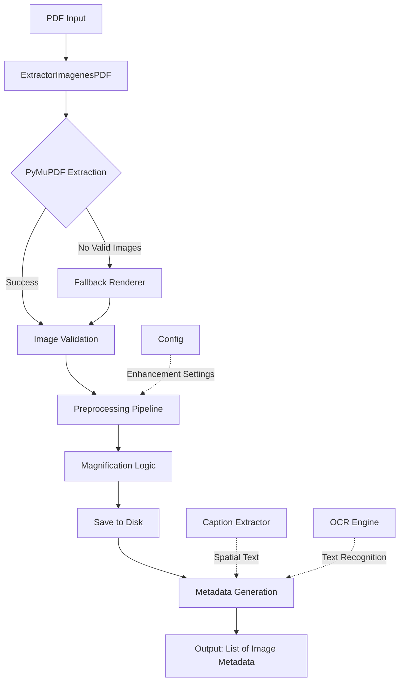
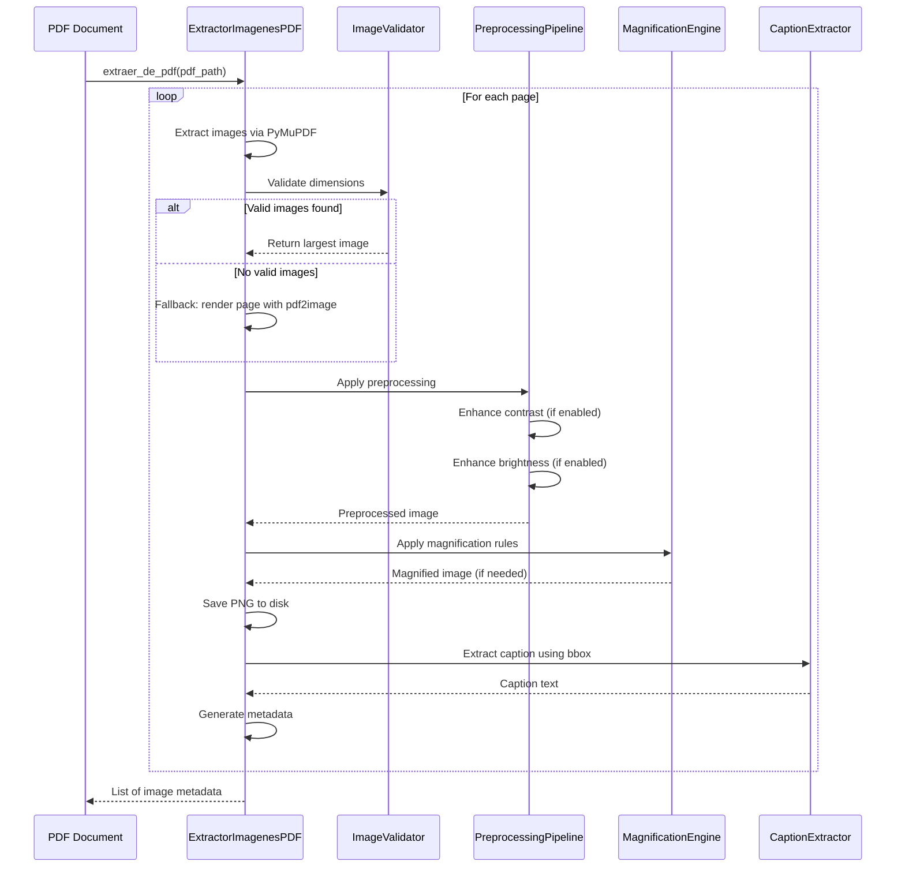

# Design Document: Improved Image Extraction

## Overview

This design document specifies the architecture and implementation details for enhancing the PDF image extraction system in the medical histology RAG application. The current `ExtractorImagenesPDF` class provides basic image extraction using PyMuPDF with minimal preprocessing. This enhancement adds intelligent image quality improvements, magnification for consistent embedding quality, configurable preprocessing pipelines, and robust fallback mechanisms.

### Design Goals

1. **Maintain Backward Compatibility**: Preserve existing class interface and method signatures
2. **Improve Image Quality**: Add contrast and brightness enhancement for better visual analysis
3. **Standardize Image Size**: Magnify small images to target size (868px) for consistent embedding quality
4. **Robust Fallback**: Enhance pdf2image fallback with same preprocessing pipeline
5. **Configurable Enhancement**: Allow runtime configuration of preprocessing operations
6. **Preserve Existing Features**: Maintain caption extraction, page text extraction, and OCR functionality

### Key Technical Decisions

- **Minimum Size Threshold**: Reduced from 200px to 150px to capture more valid histological images
- **Target Magnification Size**: 868px (based on reference implementation for optimal embedding quality)
- **Resampling Algorithm**: LANCZOS for high-quality upscaling
- **Enhancement Factors**: Contrast 1.2, Brightness 1.1 (tuned for histological images)
- **Configuration Approach**: Class-level configuration with instance override capability

## Architecture

### High-Level Architecture



### Component Interaction



## Components and Interfaces

### 1. Configuration Class

**Purpose**: Centralize all configuration constants for image extraction and preprocessing.

```python
class ImageExtractionConfig:
    """Configuration for image extraction and preprocessing."""
    
    # Size thresholds
    MIN_WIDTH: int = 150
    MIN_HEIGHT: int = 150
    TARGET_MAGNIFICATION_SIZE: int = 868
    
    # Enhancement settings
    ENHANCE_CONTRAST: bool = True
    ENHANCE_BRIGHTNESS: bool = True
    CONTRAST_FACTOR: float = 1.2
    BRIGHTNESS_FACTOR: float = 1.1
    
    # Fallback settings
    FALLBACK_DPI: int = 150
    
    # Resampling
    RESAMPLING_ALGORITHM = Image.Resampling.LANCZOS
```

**Interface**:
- Class attributes for all configuration values
- Can be overridden at class level or instance level
- Provides defaults that match reference implementation

### 2. Image Validator

**Purpose**: Validate image dimensions against minimum thresholds.

```python
def _validate_image_dimensions(self, image: Image.Image) -> bool:
    """
    Validate that image meets minimum size requirements.
    
    Args:
        image: PIL Image object
        
    Returns:
        True if image meets minimum dimensions, False otherwise
    """
    w, h = image.size
    return w >= self.config.MIN_WIDTH and h >= self.config.MIN_HEIGHT
```

**Interface**:
- Input: PIL Image object
- Output: Boolean indicating validity
- Uses configuration for threshold values

### 3. Preprocessing Pipeline

**Purpose**: Apply configurable image enhancements (contrast, brightness).

```python
def _apply_preprocessing(self, image: Image.Image) -> Image.Image:
    """
    Apply preprocessing enhancements to image.
    
    Applies contrast enhancement followed by brightness enhancement
    based on configuration settings.
    
    Args:
        image: PIL Image object
        
    Returns:
        Enhanced PIL Image object, or original if preprocessing fails
    """
    try:
        from PIL import ImageEnhance
        
        enhanced = image
        
        # Apply contrast enhancement first
        if self.config.ENHANCE_CONTRAST:
            enhancer = ImageEnhance.Contrast(enhanced)
            enhanced = enhancer.enhance(self.config.CONTRAST_FACTOR)
            
        # Apply brightness enhancement second
        if self.config.ENHANCE_BRIGHTNESS:
            enhancer = ImageEnhance.Brightness(enhanced)
            enhanced = enhancer.enhance(self.config.BRIGHTNESS_FACTOR)
            
        return enhanced
        
    except Exception as e:
        print(f"  ⚠️ Preprocessing failed: {e}, using original image")
        return image
```

**Interface**:
- Input: PIL Image object
- Output: Enhanced PIL Image object (or original on failure)
- Configurable via `ENHANCE_CONTRAST` and `ENHANCE_BRIGHTNESS` flags
- Applies enhancements in order: contrast → brightness
- Graceful degradation on failure

### 4. Magnification Engine

**Purpose**: Intelligently magnify small images to target size while preserving aspect ratio.

```python
def _apply_magnification(self, image: Image.Image) -> Image.Image:
    """
    Magnify image to target size if below threshold.
    
    Magnification rules:
    - If width < 868: scale to width=868, preserve aspect ratio
    - Else if height < 868: scale to height=868, preserve aspect ratio
    - Else: no magnification needed
    
    Args:
        image: PIL Image object
        
    Returns:
        Magnified PIL Image object (or original if no magnification needed)
    """
    w, h = image.size
    target = self.config.TARGET_MAGNIFICATION_SIZE
    
    # Check if magnification is needed
    if w >= target and h >= target:
        return image
        
    # Calculate new dimensions
    if w < target:
        # Scale based on width
        new_w = target
        new_h = int(h * (target / w))
        print(f"  🔍 Magnifying: {w}x{h} → {new_w}x{new_h} (width-based)")
    else:
        # Scale based on height (w >= target but h < target)
        new_h = target
        new_w = int(w * (target / h))
        print(f"  🔍 Magnifying: {w}x{h} → {new_w}x{new_h} (height-based)")
        
    # Apply magnification with LANCZOS resampling
    return image.resize((new_w, new_h), self.config.RESAMPLING_ALGORITHM)
```

**Interface**:
- Input: PIL Image object
- Output: Magnified PIL Image object (or original if no magnification needed)
- Uses LANCZOS resampling for high quality
- Preserves aspect ratio
- Logs magnification operations

### 5. Fallback Renderer

**Purpose**: Render entire PDF page as image when PyMuPDF extraction fails.

```python
def _fallback_render_page(self, pdf_path: str, page_num: int) -> Optional[Image.Image]:
    """
    Render PDF page as image using pdf2image fallback.
    
    Args:
        pdf_path: Path to PDF file
        page_num: Page number (1-indexed)
        
    Returns:
        PIL Image object or None if rendering fails
    """
    try:
        from pdf2image import convert_from_path
        
        print(f"  🔄 Fallback: rendering page {page_num} with pdf2image")
        
        pag_imgs = convert_from_path(
            pdf_path,
            first_page=page_num,
            last_page=page_num,
            dpi=self.config.FALLBACK_DPI
        )
        
        if pag_imgs:
            return pag_imgs[0]
        return None
        
    except Exception as e:
        print(f"  ❌ Fallback rendering failed for page {page_num}: {e}")
        return None
```

**Interface**:
- Input: PDF path and page number
- Output: PIL Image object or None on failure
- Uses pdf2image library
- Configurable DPI setting
- Logs fallback invocation and failures

### 6. Caption Extractor (Preserved)

**Purpose**: Extract descriptive text spatially located below images.

**Interface**: Existing `extraer_caption_imagen` static method preserved as-is:
- Input: PyMuPDF page object, image bounding box, full page text
- Output: Caption string (text below image or fallback to first 500 chars)
- Uses spatial positioning based on bbox

### 7. Main Extraction Orchestrator

**Purpose**: Coordinate the entire extraction workflow for a PDF.

**Modified Method**: `extraer_de_pdf`

```python
def extraer_de_pdf(self, pdf_path: str) -> List[Dict[str, str]]:
    """
    Extract and process images from PDF file.
    
    Workflow:
    1. Open PDF with PyMuPDF
    2. For each page:
        a. Extract images via PyMuPDF
        b. Validate dimensions
        c. Select largest valid image
        d. If no valid images: fallback to page rendering
        e. Apply preprocessing pipeline
        f. Apply magnification logic
        g. Save to disk as PNG
        h. Extract caption and page text
        i. Generate metadata
    3. Return list of image metadata
    
    Args:
        pdf_path: Path to PDF file
        
    Returns:
        List of dictionaries containing image metadata
    """
```

## Data Models

### Image Metadata Structure

```python
{
    "path": str,              # Full path to saved PNG file
    "fuente_pdf": str,        # Source PDF filename (basename only)
    "pagina": int,            # Page number (1-indexed)
    "indice": int,            # Image index on page (always 1 for largest)
    "ocr_text": str,          # OCR text from image (first 300 chars)
    "texto_pagina": str,      # Complete page text
    "caption": str            # Caption text (spatial or fallback)
}
```

**Invariants**:
- All fields must be present in every metadata dictionary
- `path` must point to an existing PNG file
- `pagina` must be >= 1
- `indice` is always 1 (we extract only the largest image per page)
- Structure is identical regardless of extraction method (PyMuPDF or fallback)

### Configuration Model

```python
class ImageExtractionConfig:
    MIN_WIDTH: int
    MIN_HEIGHT: int
    TARGET_MAGNIFICATION_SIZE: int
    ENHANCE_CONTRAST: bool
    ENHANCE_BRIGHTNESS: bool
    CONTRAST_FACTOR: float
    BRIGHTNESS_FACTOR: float
    FALLBACK_DPI: int
    RESAMPLING_ALGORITHM: Image.Resampling
```

## Correctness Properties

*A property is a characteristic or behavior that should hold true across all valid executions of a system—essentially, a formal statement about what the system should do. Properties serve as the bridge between human-readable specifications and machine-verifiable correctness guarantees.*

### Property Reflection

After analyzing all acceptance criteria, I identified the following redundancies:
- Properties 1.1 and 1.2 (width/height filtering) are subsumed by Property 1.4 (combined dimension invariant)
- Property 2.5 (aspect ratio preservation) is implied by Properties 2.1 and 2.2 when properly implemented
- Property 10.5 is redundant with Properties 9.2 and 9.5

The following properties represent the minimal, non-redundant set that provides complete coverage:

### Property 1: Dimension Filtering Invariant

*For any* extracted image, both width and height SHALL be greater than or equal to the minimum threshold (150 pixels).

**Validates: Requirements 1.1, 1.2, 1.4**

### Property 2: Largest Image Selection

*For any* PDF page with multiple valid images, the selected image SHALL have the maximum area (width × height) among all valid images on that page.

**Validates: Requirements 1.3**

### Property 3: Width-Based Magnification

*For any* extracted image with width less than 868 pixels, the magnified image SHALL have width equal to 868 pixels and the aspect ratio SHALL be preserved within 1% tolerance.

**Validates: Requirements 2.1, 2.5**

### Property 4: Height-Based Magnification

*For any* extracted image with height less than 868 pixels AND width greater than or equal to 868 pixels, the magnified image SHALL have height equal to 868 pixels and the aspect ratio SHALL be preserved within 1% tolerance.

**Validates: Requirements 2.2, 2.5**

### Property 5: No Magnification for Large Images

*For any* extracted image with both width and height greater than or equal to 868 pixels, the image dimensions SHALL remain unchanged after magnification processing.

**Validates: Requirements 2.4**

### Property 6: Pixel Value Bounds Invariant

*For any* preprocessed image, all pixel values SHALL be within the valid range [0, 255] for 8-bit images.

**Validates: Requirements 3.5**

### Property 7: Page Text Completeness

*For any* page with an extracted image, the metadata SHALL contain the complete page text from that page only (not adjacent pages).

**Validates: Requirements 7.2**

### Property 8: PNG Format Invariant

*For any* extracted image, the saved file SHALL be in PNG format.

**Validates: Requirements 9.1**

### Property 9: Metadata Structure Invariant

*For any* extracted image, the metadata dictionary SHALL contain exactly these fields: path, fuente_pdf, pagina, indice, ocr_text, texto_pagina, caption.

**Validates: Requirements 9.2, 10.5**

### Property 10: Filename Convention Invariant

*For any* extracted image, the filename SHALL match the pattern `{pdf_name}_pag{page_number}.png` or `{pdf_name}_pag{page_number}_full.png` (for fallback).

**Validates: Requirements 9.3**

### Property 11: Output Directory Invariant

*For any* extracted image, the file SHALL be saved to the configured output directory.

**Validates: Requirements 9.4**

### Property 12: Metadata Consistency Across Methods

*For any* two images extracted using different methods (PyMuPDF vs Fallback_Renderer), the metadata structure SHALL be identical (same keys, same types).

**Validates: Requirements 9.5**

## Error Handling

### Error Handling Strategy

The system follows a **graceful degradation** approach:
1. **Continue on failure**: Individual page failures do not terminate the entire extraction
2. **Fallback mechanisms**: Multiple fallback strategies for robustness
3. **Preserve partial results**: Save unprocessed images if preprocessing fails
4. **Comprehensive logging**: Log all errors, warnings, and fallback invocations

### Error Scenarios and Handling

| Error Scenario | Handling Strategy | User Impact |
|---------------|-------------------|-------------|
| PDF cannot be opened | Log error, return empty list | No images extracted from that PDF |
| PyMuPDF extraction fails for a page | Invoke fallback renderer | Page rendered as full image |
| Fallback renderer fails | Log error, skip page, continue | That page is skipped |
| Image validation fails | Skip image, try next | Small images filtered out |
| Preprocessing fails | Log warning, save unprocessed image | Image saved without enhancements |
| Magnification fails | Log warning, save original size | Image saved at original size |
| Caption extraction fails | Use fallback (first 500 chars of page text) | Caption may be less precise |
| OCR fails | Store empty string for ocr_text | OCR field empty but extraction continues |
| Page text extraction fails | Store empty string for texto_pagina | Page text field empty but extraction continues |
| File save fails | Log error, skip that image | That image not saved |

### Logging Requirements

All error handling must include appropriate logging:

```python
# Error logging format
print(f"❌ Error opening {pdf_path}: {e}")
print(f"⚠️ Preprocessing failed: {e}, using original image")
print(f"🔄 Fallback: rendering page {page_num} with pdf2image")
print(f"🔍 Magnifying: {w}x{h} → {new_w}x{new_h}")
```

**Log Levels**:
- ❌ (Error): Critical failures that prevent processing
- ⚠️ (Warning): Non-critical failures with fallback
- 🔄 (Info): Fallback invocations
- 🔍 (Info): Magnification operations
- ✅ (Success): Successful completions

## Testing Strategy

### Dual Testing Approach

This feature requires both **unit tests** and **property-based tests** for comprehensive coverage:

- **Unit Tests**: Verify specific examples, edge cases, configuration behavior, and integration points
- **Property Tests**: Verify universal invariants across all inputs using randomized testing

### Property-Based Testing

**Library**: `hypothesis` (Python property-based testing library)

**Configuration**: Minimum 100 iterations per property test

**Test Tagging**: Each property test must include a comment referencing the design property:

```python
# Feature: improved-image-extraction, Property 1: Dimension Filtering Invariant
@given(images=st.builds(generate_random_image, 
                        width=st.integers(0, 300), 
                        height=st.integers(0, 300)))
@settings(max_examples=100)
def test_dimension_filtering_invariant(images):
    """For any extracted image, dimensions must be >= 150px"""
    ...
```

### Property Test Coverage

| Property | Test Strategy | Generator Strategy |
|----------|--------------|-------------------|
| Property 1: Dimension Filtering | Generate random images with varying dimensions (0-300px), verify all extracted images have dimensions >= 150px | Random width/height in range [0, 300] |
| Property 2: Largest Image Selection | Generate random collections of 2-10 valid images per page, verify selected image has maximum area | Random image collections with varying dimensions |
| Property 3: Width-Based Magnification | Generate random images with width < 868px, verify magnification to 868px width with aspect ratio preserved | Random width in [150, 867], random height in [150, 2000] |
| Property 4: Height-Based Magnification | Generate random images with height < 868px and width >= 868px, verify magnification to 868px height | Width in [868, 2000], height in [150, 867] |
| Property 5: No Magnification for Large Images | Generate random images with both dimensions >= 868px, verify no dimension changes | Width and height both in [868, 3000] |
| Property 6: Pixel Value Bounds | Generate random images, apply preprocessing, verify all pixels in [0, 255] | Random images with various pixel distributions |
| Property 7: Page Text Completeness | Generate multi-page PDFs, verify page text is from current page only | Random multi-page PDFs with distinct text per page |
| Property 8: PNG Format | Extract images from various PDFs, verify all are PNG format | Various PDF structures |
| Property 9: Metadata Structure | Extract images using both methods, verify all metadata has required fields | PDFs with and without extractable images |
| Property 10: Filename Convention | Extract images from various PDFs, verify all filenames match pattern | Various PDF names and page numbers |
| Property 11: Output Directory | Extract with different output directories, verify files in correct location | Random output directory paths |
| Property 12: Metadata Consistency | Extract using both methods, verify metadata structure is identical | PDFs triggering both extraction paths |

### Unit Test Coverage

Unit tests will cover:

1. **Configuration Behavior** (Requirements 4.x):
   - Default configuration values
   - Configuration override
   - Conditional preprocessing based on flags

2. **Preprocessing Operations** (Requirements 3.x):
   - Contrast enhancement with factor 1.2
   - Brightness enhancement with factor 1.1
   - Correct ordering (contrast before brightness)
   - Error handling and fallback to unprocessed image

3. **Resampling Algorithm** (Requirement 2.3):
   - Verify LANCZOS is used for magnification

4. **Fallback Mechanism** (Requirements 5.x):
   - Fallback triggered when no valid images
   - pdf2image invoked with correct DPI
   - Preprocessing applied to fallback images
   - Magnification applied to fallback images
   - Error handling when fallback fails

5. **Caption Extraction** (Requirements 6.x):
   - Spatial extraction using bbox
   - Text from below image to page end
   - Fallback to first 500 chars when no text below
   - Exclusion of text above image

6. **Page Text Extraction** (Requirements 7.x):
   - Current page only (not adjacent)
   - Error handling with empty string fallback

7. **Error Handling and Logging** (Requirements 8.x):
   - Error logging with page numbers
   - Warning logging for preprocessing failures
   - Fallback reason logging
   - Magnification dimension logging
   - Resilience (continue on page failure)

8. **Backward Compatibility** (Requirements 10.x):
   - Class name preservation
   - Method signature preservation
   - Constructor signature preservation
   - Static method signature preservation

### Test Organization

```
tests/
├── unit/
│   ├── test_configuration.py
│   ├── test_preprocessing.py
│   ├── test_fallback.py
│   ├── test_caption_extraction.py
│   ├── test_error_handling.py
│   └── test_backward_compatibility.py
└── property/
    ├── test_dimension_properties.py
    ├── test_magnification_properties.py
    ├── test_preprocessing_properties.py
    ├── test_metadata_properties.py
    └── test_output_properties.py
```

### Integration Testing

Integration tests will verify:
- End-to-end extraction from real PDF files
- Interaction with PyMuPDF library
- Interaction with pdf2image library
- Interaction with PIL/Pillow library
- File system operations (save, directory creation)

## Implementation Plan

### Phase 1: Configuration and Infrastructure

1. Create `ImageExtractionConfig` class with all constants
2. Update `ExtractorImagenesPDF.__init__` to accept optional config
3. Update `MIN_WIDTH` and `MIN_HEIGHT` from 200 to 150

### Phase 2: Preprocessing Pipeline

1. Implement `_apply_preprocessing` method
2. Add PIL ImageEnhance imports
3. Implement contrast enhancement (factor 1.2)
4. Implement brightness enhancement (factor 1.1)
5. Add error handling with fallback to original image

### Phase 3: Magnification Engine

1. Implement `_apply_magnification` method
2. Add dimension checking logic
3. Implement width-based magnification
4. Implement height-based magnification
5. Use LANCZOS resampling
6. Add logging for magnification operations

### Phase 4: Fallback Enhancement

1. Refactor existing fallback code into `_fallback_render_page` method
2. Apply preprocessing pipeline to fallback images
3. Apply magnification logic to fallback images
4. Enhance error handling and logging

### Phase 5: Integration

1. Update `extraer_de_pdf` to use new preprocessing pipeline
2. Update `extraer_de_pdf` to use new magnification logic
3. Ensure preprocessing and magnification applied to both extraction paths
4. Verify backward compatibility

### Phase 6: Testing

1. Implement property-based tests (hypothesis)
2. Implement unit tests
3. Implement integration tests
4. Verify all properties pass with 100+ iterations

### Phase 7: Documentation and Deployment

1. Update code comments and docstrings
2. Update README if necessary
3. Performance testing with real PDFs
4. Deploy to production

## Dependencies

### Existing Dependencies (Already in Project)

- `PyMuPDF` (fitz): PDF parsing and image extraction
- `pdf2image`: Fallback page rendering
- `Pillow` (PIL): Image manipulation
- `pytesseract`: OCR functionality

### New Dependencies

- `PIL.ImageEnhance`: Image enhancement (part of Pillow, no new install needed)

### Python Version

- Python 3.8+ (for type hints and modern features)

## Performance Considerations

### Performance Impact Analysis

| Operation | Current | Enhanced | Impact |
|-----------|---------|----------|--------|
| Image extraction | ~100ms/page | ~100ms/page | No change |
| Preprocessing | N/A | ~50ms/image | +50ms |
| Magnification | N/A | ~100ms/image (for small images) | +100ms (conditional) |
| Fallback rendering | ~500ms/page | ~650ms/page | +150ms |

### Optimization Strategies

1. **Conditional Processing**: Magnification only applied when needed (dimensions < 868px)
2. **Configurable Enhancement**: Can disable preprocessing if performance is critical
3. **Lazy Evaluation**: Images processed only when valid
4. **Early Filtering**: Invalid images rejected before preprocessing

### Memory Considerations

- **Peak Memory**: Approximately 2-3x image size during preprocessing and magnification
- **Mitigation**: Process one image at a time, release memory after saving
- **Large PDFs**: Memory usage scales linearly with number of pages (one page at a time)

## Security Considerations

### Input Validation

- PDF path validation (file exists, readable)
- Image dimension validation (prevent extremely large images)
- Output directory validation (writable, within allowed paths)

### Resource Limits

- Maximum image dimensions: Implicitly limited by PIL (avoid memory exhaustion)
- Maximum PDF size: No explicit limit, but memory-constrained by processing one page at a time
- Timeout considerations: No timeouts currently, could add for very large PDFs

### Error Information Disclosure

- Error messages logged to console (not exposed to end users)
- File paths in logs (acceptable for internal application)
- No sensitive information in metadata

## Deployment Considerations

### Backward Compatibility Verification

Before deployment, verify:
1. Existing code calling `ExtractorImagenesPDF` works without modification
2. Output metadata structure unchanged
3. File naming convention unchanged
4. No breaking changes to public API

### Configuration Migration

- Default configuration matches reference implementation
- No configuration file changes required
- Optional: Add configuration to environment variables or config file

### Rollback Plan

If issues arise:
1. Revert to previous version of `ExtractorImagenesPDF`
2. Existing images remain valid (PNG format unchanged)
3. No database schema changes required

### Monitoring

Post-deployment monitoring:
- Track extraction success rate
- Monitor preprocessing failures
- Monitor fallback invocation rate
- Track average processing time per PDF
- Monitor disk space usage (images directory)

## Future Enhancements

### Potential Improvements

1. **Adaptive Enhancement**: Adjust contrast/brightness based on image histogram analysis
2. **Quality Metrics**: Add image quality scoring (blur detection, contrast measurement)
3. **Parallel Processing**: Process multiple pages concurrently
4. **Caching**: Cache preprocessed images to avoid reprocessing
5. **Format Support**: Support additional output formats (JPEG, WebP)
6. **Advanced Magnification**: Use AI-based super-resolution for better quality
7. **Metadata Enrichment**: Add image quality metrics to metadata
8. **Configuration UI**: Web interface for tuning enhancement parameters

### Research Directions

1. **Optimal Enhancement Factors**: A/B testing to find optimal contrast/brightness values
2. **Embedding Quality Correlation**: Measure impact of magnification on embedding quality
3. **Preprocessing Alternatives**: Evaluate other enhancement techniques (CLAHE, unsharp masking)
4. **Magnification Alternatives**: Compare LANCZOS with other resampling algorithms

## Appendix

### Reference Implementation

The design is based on the reference implementation from the `mueva_test` repository, specifically:
- Magnification logic with 868px target size
- LANCZOS resampling for quality
- Contrast and brightness enhancement factors
- Preprocessing pipeline architecture

### Code Style Guidelines

- Follow PEP 8 style guide
- Use type hints for all method signatures
- Document all public methods with docstrings
- Use descriptive variable names
- Keep methods focused and single-purpose
- Prefer composition over inheritance

### Testing Guidelines

- Property tests: minimum 100 iterations
- Unit tests: cover all branches
- Integration tests: use real PDF samples
- Test naming: `test_<feature>_<scenario>`
- Use fixtures for common test data
- Mock external dependencies where appropriate