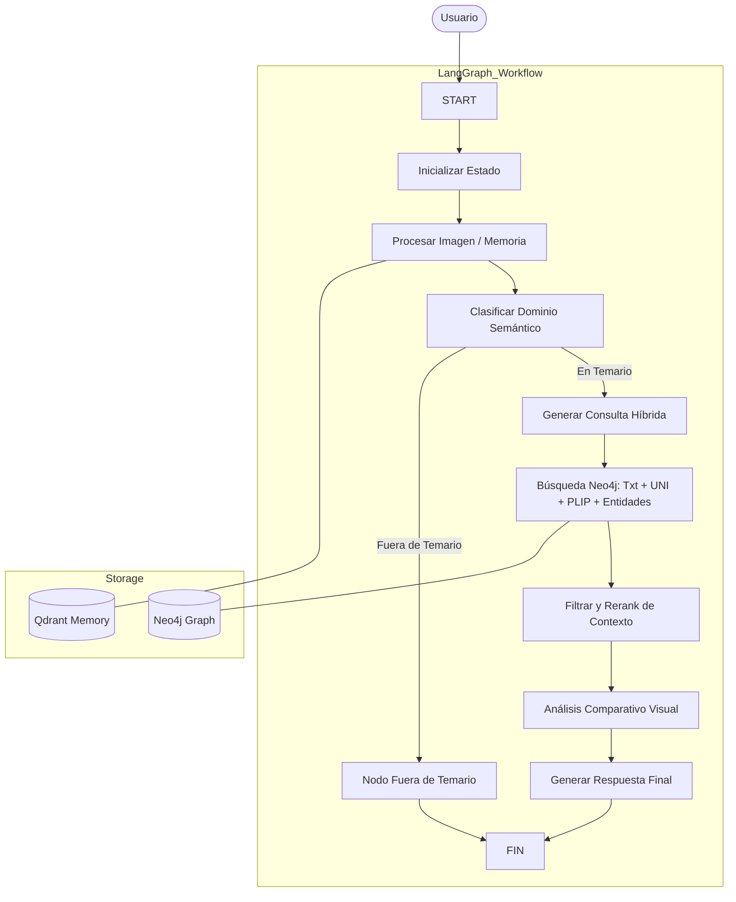

# RAG Histología Multimodal v4.1 (Neo4j + LangGraph)

Este proyecto implementa un sistema de Generación Aumentada por Recuperación (RAG) multimodal especializado en histología. Utiliza una arquitectura avanzada basada en grafos para la orquestación del flujo de trabajo y una base de datos de grafos para el almacenamiento y recuperación de conocimiento complejo.

## 🚀 Características Principales

*   **Arquitectura LangGraph**: Flujo de trabajo orquestado mediante grafos de estado para un control preciso de la lógica de razonamiento.
*   **Recuperación Híbrida**: Combina búsqueda semántica por texto (HuggingFace), búsqueda visual (modelos especializados UNI y PLIP), y búsqueda por entidades en grafo (Neo4j).
*   **Memoria Semántica Persistente**: Utiliza Qdrant para mantener un historial de conversación y contexto visual (imágenes) entre turnos.
*   **Modelos de SOTA**:
    *   **LLM**: Groq (Llama 4) para razonamiento ultrarrápido.
    *   **Embeddings de Imagen**: **UNI** (Mahmood Lab) y **PLIP** para representaciones histológicas precisas.
    *   **Embeddings de Texto**: `all-MiniLM-L6-v2` (Sentence-Transformers).
*   **Detección de Hardware**: Fallback automático a CPU si la GPU es incompatible (CUDA capability < 7.0).

## 🏗️ Arquitectura del Sistema



## 📊 Esquema de Grafo (Neo4j)

El sistema organiza el conocimiento en los siguientes nodos y relaciones:

*   **Nodos**: `PDF`, `Chunk`, `Imagen`, `Tejido`, `Estructura`, `Tincion`, `Pagina`.
*   **Relaciones**:
    *   `(Chunk)-[:PERTENECE_A]->(PDF)`: Trazabilidad de origen.
    *   `(Chunk)-[:MENCIONA]->(Tejido|Estructura|Tincion)`: Vinculación semántica.
    *   `(Tejido)-[:CONTIENE]->(Estructura)`: Jerarquía anatómica.
    *   `(Tejido|Estructura)-[:TENIDA_CON]->(Tincion)`: Conocimiento de técnicas.
    *   `(Imagen)-[:SIMILAR_A]->(Imagen)`: Relaciones visuales por embedding UNI.

## 🛠️ Requisitos e Instalación

1.  **Dependencias**: El proyecto utiliza `uv` para la gestión de paquetes.
    ```bash
    uv sync
    ```
2.  **Configuración**: Copia el archivo `.env.example` a `.env` y completa tus credenciales.
    *   `GROQ_API_KEY`: Para el razonamiento del LLM.
    *   `HF_TOKEN`: (Read) Para descargar los modelos UNI y PLIP.
    *   `NEO4J_URI`, `NEO4J_USERNAME`, `NEO4J_PASSWORD`: Credenciales de tu base de datos Neo4j (AuraDB recomendada).

## 🖥️ Ejecución

Para iniciar el servidor en modo desarrollo:
```bash
npm run dev
```

El servidor utiliza FastAPI y Uvicorn, escuchando por defecto en el puerto `10005`.
