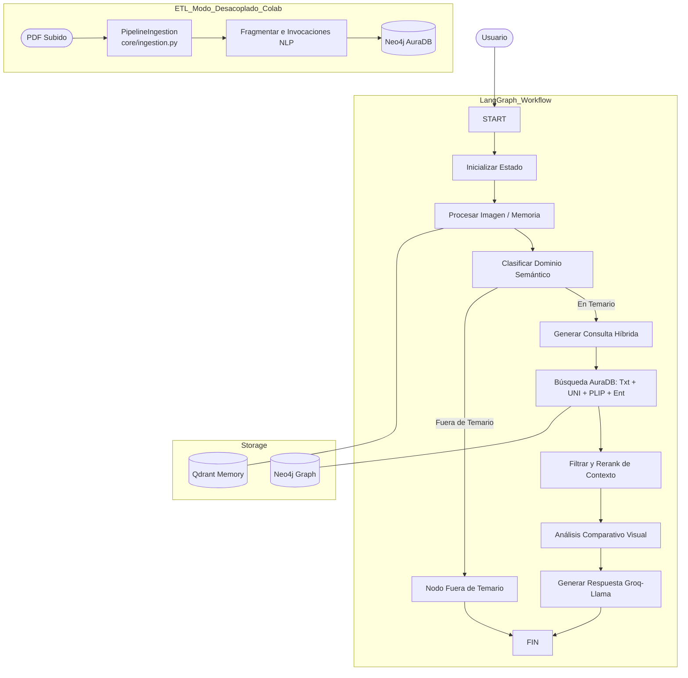

# RAG Histología Multimodal v4.4 (Neo4j + LangGraph + Decoupled ETL)

Este proyecto implementa un sistema de Generación Aumentada por Recuperación (RAG) multimodal especializado en histología. Utiliza una arquitectura avanzada modularizada basada en grafos de estado (LangGraph) para la orquestación del flujo de trabajo y una base de datos de grafos (Neo4j) para el almacenamiento profundo.

## 🚀 Características Principales (v4.4 Update)

*   **Arquitectura Modular**: El monolito fue factorizado en componentes de negocio (`core/`, `db/`, `extractors/`, `models/`, `utils/`) haciéndolo fácilmente testeable, re-utilizable y mantenible.
*   **Separación de Concerns (Data vs Inferencia)**: El módulo `PipelineIngestion` (`core/ingestion.py`) aisla fuertemente el procesamiento masivo ETL (Extracción de PDFs, Embeddings e Inserción), lo cual permite correr el pre-procesamiento intensivo en servidores efímeros gratuitos como Google Colab (GPU acelerada), mientras la UI o el agente puede correr en hardware liviano.
*   **Recuperación Híbrida**: Combina búsqueda semántica por texto (HuggingFace local), búsqueda visual nativa (modelos médicos especializados *UNI* y *PLIP*), y comprobación heurística por entidades exactas en grafo Neo4j.
*   **Memoria Semántica Persistente**: Utiliza Qdrant alojado localmente en modo `:memory:` (versión >1.11.0 nativa) para condensar historiales dinámicos que no desbordan la context-window.
*   **Traducción Estructural y Desacoplamiento de Prompts**: Se tradujo la totalidad del código fuente, variables internas (StateGraph) y definiciones de clase al lenguaje inglés para alinear la sintaxis con convenciones de desarrollo estándar. Adicionalmente, todos los System Prompts estáticos fueron extraídos del código duro y externalizados a la carpeta `prompts/`, garantizando así que el contexto inyectado al LLM conserve un formato estricto y puro 100% en español.
*   **Gestor de Secretos Híbrido Cero Fricción**: Identifica inteligentemente el entorno de ejecución, recuperando las variables desde un `.env` oculto si está en la terminal local, o acudiendo secretamente al Secure Vault nativo de `google.colab.userdata` cuando corre en la arquitectura serverless.

## 🏗️ Arquitectura del Sistema



## 📊 Esquema de Grafo (Neo4j)

El sistema organiza el conocimiento en los siguientes nodos y relaciones dentro de su ontología:

*   **Nodos**: `PDF`, `Chunk`, `Imagen`, `Tejido`, `Estructura`, `Tincion`, `Pagina`.
*   **Relaciones**:
    *   `(Chunk)-[:PERTENECE_A]->(PDF)`: Trazabilidad del origen documental.
    *   `(Chunk)-[:MENCIONA]->(Tejido|Estructura|Tincion)`: Vinculación semántica y de palabras clave.
    *   `(Tejido)-[:CONTIENE]->(Estructura)`: Jerarquía anatómica pura inferida.
    *   `(Tejido|Estructura)-[:TENIDA_CON]->(Tincion)`: Conocimiento de técnicas y marcadores histológicos.
    *   `(Imagen)-[:SIMILAR_A]->(Imagen)`: Relaciones visuales de espacio latente basadas en el embedding UNI.

## 🛠️ Requisitos e Instalación

1.  **Dependencias e Inicialización**: El proyecto depende eficientemente de `uv` instalado a nivel sistema o python (`pip install uv`).
    ```bash
    uv pip install -r pyproject.toml
    ```
2.  **Configuración de Entorno**: Copia `.env.example` a `.env` (en el directorio principal) e inserta tus credenciales, o usa el Gestor de Secretos de Colab.
    *   `GROQ_API_KEY`: Generación RAG a través de Llama 4.
    *   `HF_TOKEN`: Autorización a HuggingFace Hub para instalar los motores UNI/PLIP.
    *   `NEO4J_URI`, `NEO4J_USERNAME`, `NEO4J_PASSWORD`: Credenciales a Graph DB (Neo4j AuraDB).

## 🖥️ Ejecución

Existen diversos flujos diseñados específicamente para su respectiva plataforma de ejecución:

**Opción A: Ingestión Remota en Google Colab (Pre-Procesado masivo)**
Sube el archivo `notebooks/Ingesta_Neo4J_Histo.ipynb` a Google Colab. Asigna una instancia T4 GPU, incluye los secretos arriba mencionados y ejecuta la Celda 2. Extraerá las imágenes masivamente de tus PDFs hacia el índice vectorial de Neo4j en la Nube.

**Opción B: Chat Interactivo Frontend (Inferencia UI Local)**
Para ejecutar la interfaz gráfica y levantar todo el sistema cliente-servidor, que incluye `server.py` escuchando a la lógica de RAG y el renderizado del código cliente reactivo:
```bash
npm run dev
```
*El servidor utiliza internamente FastAPI y Uvicorn, inicializándose y escuchando por defecto en el puerto `10005`.*

**Opción C: Chat Interactivo de Consola (Inferencia CLI Local)**
Si prefieres un uso estricto en la línea de comandos de tu terminal gráfica (bypasseando el servidor web de FastAPI):
```bash
python main.py
```
*(Asegúrate de tener instaladas localmente las dependencias de Sistema Operativo `tesseract-ocr` y `poppler-utils` que exigen `pytesseract` y `pdf2image`)*
