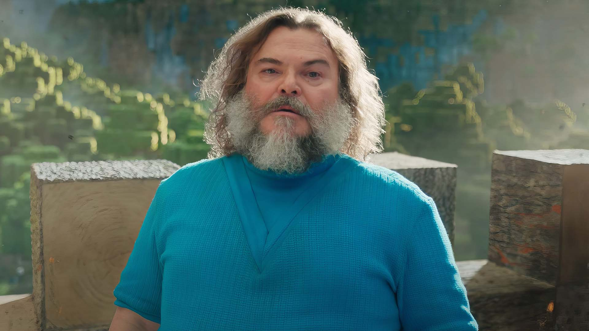
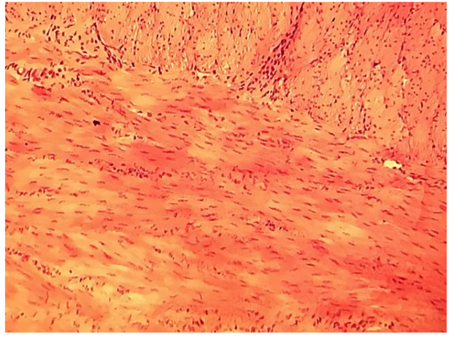

# Manual 
## Setting the Colab Notebook Up
Run in the colab notebook set up in [here](https://colab.research.google.com/drive/1r7AawAnFF_2yCxp4O37n64f3LiX8Lvk1?usp=sharing).
```
✅ PLIP Loaded
✅ Base models ready.
🏗️ Creating Neo4j Schema (v4.4 UNI + PLIP)...
✅ Neo4j Schema Ready (3 indexes)
✅ LangGraph compiled (v4.4)
```

## 1st Case: Sending a totally unrelated picture
The image we will be using for this test is:

### Input
```
👤 Tu consulta: imagen imagenes_chat/unrelated.jpg
✅ Imagen 'unrelated.jpg' cargada en memoria temporal.

[📷 Imagen cargada y lista para la siguiente pregunta]
👤 Tu consulta: ¿podrías explicarme las características de la imagen?
```
### Output
```
⏳ Analizando y procesando (LangGraph en curso)...
   🔍 [Node] Verifying domain...
   🔄 Pre-calculating Semantic Anchor embeddings...
   📐 Semantic Similarity to domain: 0.8102
   👁️ [Node] Processing user image...
   🧠 [Node] Retrieving memory context...
   🔎 [Node] Executing hybrid multispace search...
   📊 Hybrid Search: Txt=8 | UNI=8 | PLIP=8 | Ent=0 | Vec=14 -> 35
   ✍️ [Node] Generating final response (Role: Sceptical Judge)...
   🧠 Interaction saved to semantic memory (Session: cli_loca)

🧠 ASISTENTE:
Lo siento, pero la imagen subida por el usuario no corresponde a una imagen histológica. Por lo tanto, no puedo proporcionar una descripción de características celulares, tinciones probables, estructuras visibles o posibles diagnósticos/tejidos en el contexto de la histología.

La imagen muestra a un hombre con cabello largo y una barba gris, vistiendo una camisa azul. Está de pie frente a lo que parecen ser bloques de piedra o concreto de diferentes colores y texturas. El fondo de la imagen sugiere un entorno al aire libre con vegetación.

No hay estructuras histológicas que analizar en esta imagen. 

Fuentes usadas: 
- Imagen subida por el usuario.
- Conocimientos generales de histología y anatomía humana. 

(No se han utilizado fuentes bibliográficas específicas para responder a esta pregunta, ya que no se relaciona con el contenido histológico proporcionado.)

   🏷️  Diagnóstico Visual: No aplica
------------------------------------------------------------
```
### Conclusion
The agent correctly declines trying to answer an unrelated question.
## 2nd Case: Sending a related picture (screenshot from the pdf)
The image we will be using for this test is a screnshot from the manual.

### Input
```
👤 Tu consulta: imagen /content/histo-test/imagenes_chat/upload_77c47a5c.jpg
✅ Imagen 'upload_77c47a5c.jpg' cargada en memoria temporal.

[📷 Imagen cargada y lista para la siguiente pregunta]

👤 Tu consulta: ¿podrías explicarme las características del tejido de la imagen?
```
### Output
```
⏳ Analizando y procesando (LangGraph en curso)...
   🔍 [Node] Verifying domain...
   📐 Semantic Similarity to domain: 0.8108
   👁️ [Node] Processing user image...
   🧠 [Node] Retrieving memory context...
   🔎 [Node] Executing hybrid multispace search...
   📊 Hybrid Search: Txt=8 | UNI=8 | PLIP=8 | Ent=0 | Vec=15 -> 28
   ✍️ [Node] Generating final response (Role: Sceptical Judge)...
   🧠 Interaction saved to semantic memory (Session: cli_loca)

🧠 ASISTENTE:
Análisis de la Imagen Histológica

La imagen histológica presentada muestra una sección de tejido con una coloración rojiza y amarillenta, lo que sugiere que ha sido teñida con Hematoxilina y Eosina (H&E), una técnica de tinción común en histología.

**Características Celulares y Estructurales**

En esta imagen, se observan células alargadas y fusiformes con núcleos elongados, que se disponen en una matriz extracelular abundante. Las células presentan una orientación irregular, algunas de ellas se disponen en haces o fascículos entrelazados. La matriz extracelular es abundante y homogénea, con una coloración rosa pálido.

**Posibles Diagnósticos**

Estas características sugieren que el tejido corresponde a un tipo de tejido conjuntivo. La presencia de células fusiformes y la disposición en haces o fascículos, junto con la abundante matriz extracelular, son características típicas del tejido conjuntivo fibroso, específicamente del tejido conjuntivo denso irregular.

**Estructuras Identificadas**

- Células fusiformes con núcleos elongados
- Matriz extracelular abundante y homogénea
- Disposición irregular de las células
- Haces o fascículos entrelazados

**Tejidos Considerados**

- Tejido conjuntivo fibroso
- Tejido cicatricial
- Posiblemente, un tipo de tumor como un fibroma o un leiomioma, aunque esto requeriría más información clínica e histológica.

**Estructura**

La estructura del tejido parece ser de un tejido conjuntivo fibroso, con una disposición irregular de las células y una abundante matriz extracelular.

**Fuentes Usadas**

- Gartner, L. P., Nava, A. S., Isabel, G. P. M., Ángel, H. E. M., & Roig, G. F. (2018). Histología: Atlas en color y texto. (7a. Ed.). Wolters Kluwer.
- I. F. van der G. T. (2017). Histología y Biología Celular. (3a. Ed.) McGraw Hill.
- Junqueira, L. C., Carneiro, J., & Isabel, G. P. M. (2022). Histología Básica: Texto y atlas. (13a. Ed.) Panamericana.

En base a las características observadas en la imagen histológica y la información disponible en las fuentes citadas, se puede concluir que el tejido presentado corresponde a un tejido conjuntivo fibroso.

   🏷️  Diagnóstico Visual: Tejido Conjuntivo Fibroso
------------------------------------------------------------
```

### Conclusion
The LLM correctly identifies the image from the manual and provides its description.

### 3rd case: Sending a histological image that is not in the manual
In this case we will be using an image from a brain biopsy.


According to the web from which this image was retrieved, the image depicts: "Imagen A: Una histopatología de la carcinomatosis meníngea: grupos de células tumorales en el espacio subaracnoideo en una biopsia cerebral (Fotografía cortesía del Dr. Michael J. Schneck, MD).".
### Input
```
👤 Tu consulta: imagen /content/histo-test/imagenes_chat/biopsia_cerebro.jpg
✅ Imagen 'biopsia_cerebro.jpg' cargada en memoria temporal.

[📷 Imagen cargada y lista para la siguiente pregunta]

👤 Tu consulta: ¿podrías explicarme de qué se trata la imagen?
```

### Output

```
⏳ Analizando y procesando (LangGraph en curso)...
   🔍 [Node] Verifying domain...
   📐 Semantic Similarity to domain: 0.8105
   👁️ [Node] Processing user image...
   🧠 [Node] Retrieving memory context...
   🔎 [Node] Executing hybrid multispace search...
   📊 Hybrid Search: Txt=8 | UNI=8 | PLIP=8 | Ent=0 | Vec=12 -> 28
   ✍️ [Node] Generating final response (Role: Sceptical Judge)...
   🧠 Interaction saved to semantic memory (Session: cli_loca)

🧠 ASISTENTE:
**Análisis de la Imagen Histológica**

La imagen histológica presentada muestra una sección tisular teñida, probablemente con Hematoxilina y Eosina (H&E), dada la coloración característica en tonos de rosa y púrpura. A continuación, se presentan los detalles observados en la imagen:

**Zona Superior**

* Capa de células más densamente empaquetadas y teñidas de un color más intenso
* Disposición irregular de las células
* Posible presencia de núcleos celulares y citoplasma más densamente teñido

**Zona Inferior**

* Tejido con células más dispersas y una matriz más clara
* Células con núcleos más grandes y menos densos en comparación con la zona superior

**Posible Diagnóstico**

Dada la morfología y la tinción, es posible que esta imagen corresponda a una sección de un tumor o una lesión específica. Sin embargo, sin más contexto o información, es difícil proporcionar un diagnóstico preciso.

**Estructuras Relacionadas**

En la literatura histológica, se han descrito estructuras similares en diversos tejidos, incluyendo:

* **Meningioma**: un tipo de tumor que se origina en las meninges, las membranas que cubren el cerebro y la médula espinal. (Fuente: "Histología: Atlas en color y texto" de Gartner et al., 2018)
* **Tejido Conectivo Especializado**: un tipo de tejido que se caracteriza por su función específica y su estructura única. (Fuente: "Histología y Biología Celular" de van der G., 2017)

**Fuentes Utilizadas**

* Gartner, L. P., Nava, A. S., Isabel, G. P. M., Ángel, H. E. M., & Roig, G. F. (2018). Histología: Atlas en color y texto. (7a. Ed.). Wolters Kluwer.
* van der G. T. (2017). Histología y Biología Celular. (3a. Ed.) McGraw Hill.

En conclusión, la imagen histológica presentada muestra una sección tisular con características morfológicas y de tinción que sugieren un posible diagnóstico de meningioma o una lesión similar. Sin embargo, es importante considerar que un diagnóstico preciso requiere más contexto y información.

   🏷️  Diagnóstico Visual: Meningioma
------------------------------------------------------------

👤 Tu consulta: salir
👋 ¡Hasta luego!

```
### Conclusion
It correctly identified the patology (Meningioma) even when the image wasn't in the manual. However, the LLM didn't clarify that the information could be inaccurate because the image didn't come from the manual.

However, it also said: "Dada la morfología y la tinción, es posible que esta imagen corresponda a una sección de un tumor o una lesión específica. Sin embargo, sin más contexto o información, es difícil proporcionar un diagnóstico preciso.".

